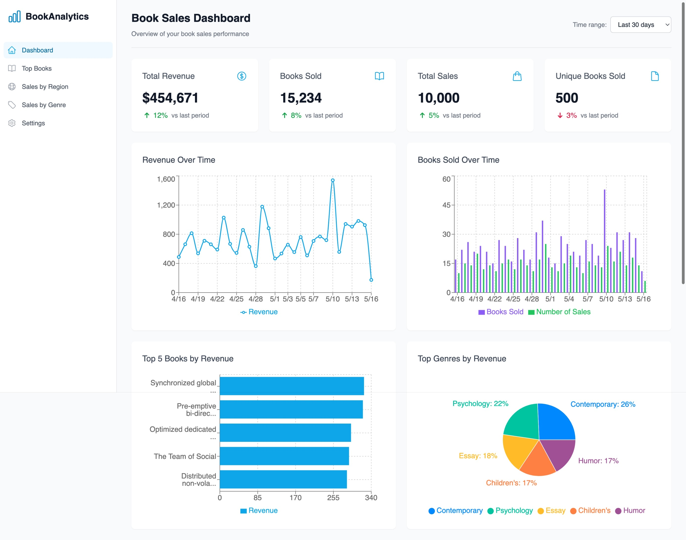

# Book Sales Analytics Dashboard



## Research Project & Benchmarking Initiative

This project serves as a research prototype and benchmarking initiative to evaluate the feasibility and performance of a modern data analytics architecture for high-volume book sales data. The goal is to determine if this architecture can handle our expected data growth while providing performant analytics capabilities.

## Architecture Overview

The architecture employs a data warehouse approach to offload analytics processing from the transactional database:


For detailed architecture diagrams, see the [docs directory](docs/):
- [Architecture Diagram](docs/architecture-diagram.md)
- [Data Flow Diagram](docs/data-flow-diagram.md)
- [Database Schema](docs/database-schema.md)

### Key Components

1. **Data Sources**
   - Django ORM models for transactional data (Book and Sale models)
   - CSV file imports for historical data
   - Test data generation for benchmarking

2. **Data Pipeline**
   - ETL processes to extract data from Django database
   - AWS S3 for data lake storage
   - AWS Glue for data transformation (optional)
   - AWS Redshift for data warehousing

3. **API Layer**
   - Django REST Framework (DRF) for API endpoints
   - Custom analytics views that query Redshift
   - Authentication and permission controls
   - Response caching for performance

4. **Frontend**
   - React.js for UI components
   - Tailwind CSS for styling
   - Recharts for data visualization
   - Vite for build tooling and development

## Technology Stack

### Backend
- **Django**: Web framework for the main application
- **Django REST Framework**: API development
- **PostgreSQL**: Transactional database
- **Redshift Connector**: Python library for Redshift connection
- **Pandas**: Data manipulation and transformation
- **AWS SDK (boto3)**: Interacting with AWS services

### AWS Services
- **S3**: Object storage for raw data files
- **Redshift**: Data warehouse for analytics
- **IAM**: Access management for AWS resources
- **Glue**: ETL service (optional)

### Frontend
- **React**: UI library
- **Tailwind CSS**: Utility-first CSS framework
- **Recharts**: React charting library
- **Axios**: HTTP client
- **React Router**: Client-side routing
- **Vite**: Build tool and dev server

### DevOps & Deployment
- **Terraform**: Infrastructure as code
- **Docker**: Containerization (optional)
- **Git**: Version control

## Key Features

- **Separation of Concerns**: Analytics queries don't impact application performance
- **Scalable Architecture**: Designed to handle growing data volumes
- **Interactive Dashboards**: Real-time data visualization and filtering
- **Test Data Generation**: Built-in tools for generating realistic test data
- **Configurable Time Ranges**: Filter analytics by different time periods
- **Detailed Data Views**: Drill down into specific metrics
- **Mobile-Responsive Design**: Works across device sizes

## Performance Benchmarks

We are evaluating this architecture against the following benchmarks:

1. **Data Volume Handling**
   - Up to 10M sales records
   - Up to 500K unique book titles
   - 5+ years of historical data

2. **Query Performance**
   - Dashboard load time: < 2 seconds
   - Filter/timeframe changes: < 1 second
   - Complex aggregation queries: < 3 seconds

3. **ETL Processing**
   - Daily incremental data sync: < 10 minutes
   - Full data refresh: < 2 hours

## Setup Instructions

### Prerequisites
- Python 3.8+
- Node.js 14+
- AWS account with permissions for S3, Redshift, IAM, and Glue
- PostgreSQL database
- Terraform (for infrastructure setup)

### Backend Setup

1. Clone the repository
   ```bash
   git clone https://github.com/yourusername/book-sales-analytics.git
   cd book-sales-analytics
   ```

2. Set up Python virtual environment
   ```bash
   python -m venv venv
   source venv/bin/activate  # On Windows: venv\Scripts\activate
   pip install -r requirements.txt
   ```

3. Configure environment variables
   ```bash
   cp .env.example .env
   # Edit .env with your settings
   ```

4. Set up database
   ```bash
   python manage.py migrate
   ```

5. Deploy AWS infrastructure
   ```bash
   cd terraform
   terraform init
   terraform apply
   ```

6. Run development server
   ```bash
   python manage.py runserver
   ```

### Frontend Setup

See [frontend/README.md](frontend/README.md) for detailed frontend setup instructions.

## Usage

### Generating Test Data

```bash
# Generate 500 books and 10,000 sales records
python manage.py generate_sales_data

# Generate custom amounts
python manage.py generate_sales_data --books 1000 --sales 20000

# Generate data but don't upload to S3
python manage.py generate_sales_data --skip-upload

# Generate and upload to S3 but don't load to Redshift
python manage.py generate_sales_data --skip-redshift
```

### Accessing the Dashboard

Once both backend and frontend are running:

1. Navigate to `http://localhost:3000` in your browser
2. Log in with test credentials (if authentication is enabled)
3. Explore the different dashboard views:
   - Main Dashboard
   - Top Books
   - Sales by Region
   - Sales by Genre
   - Settings

## API Documentation

The following API endpoints are available:

| Endpoint                      | Method | Description                                |
|-------------------------------|--------|--------------------------------------------|
| `/api/analytics/summary/`     | GET    | Overall sales summary statistics           |
| `/api/analytics/timeseries/`  | GET    | Time-series data for trends               |
| `/api/analytics/top-books/`   | GET    | Top performing books by revenue           |
| `/api/analytics/sales-by-region/` | GET | Sales breakdown by region                |
| `/api/analytics/sales-by-genre/`  | GET | Sales breakdown by book genre            |
| `/api/analytics/generate-test-data/` | POST | Generate test data                   |

## Project Structure

```
book-sales-analytics/
├── README.md                     # Main documentation
├── requirements.txt              # Python dependencies
├── manage.py                     # Django management script
├── terraform/                    # Infrastructure as code
│   ├── main.tf                   # Main Terraform configuration
│   ├── variables.tf              # Variable definitions
│   └── outputs.tf                # Output definitions
├── backend/                      # Django project
│   ├── settings.py               # Project settings
│   ├── urls.py                   # URL routing
│   └── wsgi.py                   # WSGI configuration
├── books/                        # Django app for book models
│   ├── models.py                 # Book and Sale models
│   ├── views.py                  # Regular views
│   ├── admin.py                  # Admin configuration
│   └── migrations/               # Database migrations
├── analytics/                    # Analytics Django app
│   ├── views.py                  # Analytics API views
│   ├── services/                 # Business logic
│   │   └── data_export.py        # Data export service
│   └── management/               # Management commands
│       └── commands/
│           └── generate_sales_data.py  # Data generation
└── frontend/                     # React frontend
    ├── README.md                 # Frontend documentation
    ├── package.json              # Node.js dependencies
    ├── vite.config.js            # Vite configuration
    ├── index.html                # HTML entry point
    └── src/                      # React source code
        ├── main.jsx              # Main entry point
        ├── App.jsx               # App component
        ├── components/           # Reusable components
        ├── pages/                # Page components
        ├── services/             # API services
        └── layouts/              # Layout components
```

## Research Conclusions (So Far)

Our initial benchmarks show promising results:
- The architecture successfully handles up to 10M sales records
- Query performance is acceptable for our needs
- ETL processes are efficient and scalable
- Frontend visualization components are responsive and maintainable

Areas for further research:
- Cost optimization for AWS services 
- Alternative visualization libraries comparison
- Pre-aggregation strategies for faster queries
- Redshift vs BigQuery performance comparison

## Contributing

This is a research project. Please contact the project maintainers before making contributions.

## License

Proprietary - Internal Research Project
