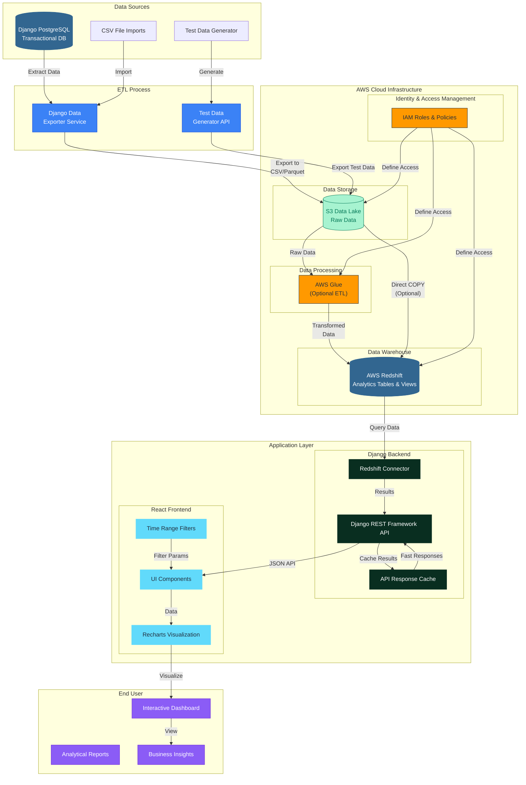

```mermaid
flowchart TB
    %% Define the main sections
    subgraph DataSources["Data Sources"]
        DB[("Django PostgreSQL\nTransactional DB")]
        CSV["CSV File Imports"]
        TestData["Test Data Generator"]
    end

    subgraph ETL["ETL Process"]
        Exporter["Django Data\nExporter Service"]
        Generator["Test Data\nGenerator API"]
    end

    subgraph AWS["AWS Cloud Infrastructure"]
        subgraph Storage["Data Storage"]
            S3[("S3 Data Lake\nRaw Data")]
        end
        
        subgraph Processing["Data Processing"]
            Glue["AWS Glue\n(Optional ETL)"]
        end
        
        subgraph Warehouse["Data Warehouse"]
            Redshift[("AWS Redshift\nAnalytics Tables & Views")]
        end
        
        subgraph IAM["Identity & Access Management"]
            Roles["IAM Roles & Policies"]
        end
    end

    subgraph Application["Application Layer"]
        subgraph Backend["Django Backend"]
            DRF["Django REST Framework API"]
            Connector["Redshift Connector"]
            Cache["API Response Cache"]
        end
        
        subgraph Frontend["React Frontend"]
            Components["UI Components"]
            Charts["Recharts Visualization"]
            Filters["Time Range Filters"]
        end
    end

    subgraph EndUser["End User"]
        Dashboard["Interactive Dashboard"]
        Reports["Analytical Reports"]
        Insights["Business Insights"]
    end

    %% Define the connections
    DB -->|"Extract Data"| Exporter
    CSV -->|"Import"| Exporter
    TestData -->|"Generate"| Generator
    
    Exporter -->|"Export to\nCSV/Parquet"| S3
    Generator -->|"Export Test Data"| S3
    
    S3 -->|"Raw Data"| Glue
    Glue -->|"Transformed\nData"| Redshift
    S3 -->|"Direct COPY\n(Optional)"| Redshift
    
    Roles -->|"Define Access"| S3
    Roles -->|"Define Access"| Glue
    Roles -->|"Define Access"| Redshift
    
    Redshift -->|"Query Data"| Connector
    Connector -->|"Results"| DRF
    DRF -->|"Cache Results"| Cache
    Cache -->|"Fast Responses"| DRF
    
    DRF -->|"JSON API"| Components
    Components -->|"Data"| Charts
    Filters -->|"Filter Params"| Components
    
    Charts -->|"Visualize"| Dashboard
    Dashboard -->|"View"| Insights
    
    %% Styling
    classDef aws fill:#FF9900,stroke:#232F3E,color:#232F3E
    classDef django fill:#092E20,stroke:#092E20,color:white
    classDef react fill:#61DAFB,stroke:#61DAFB,color:#232F3E
    classDef database fill:#326690,stroke:#326690,color:white
    classDef process fill:#3B82F6,stroke:#1D4ED8,color:white
    classDef storage fill:#A7F3D0,stroke:#047857,color:#047857
    classDef user fill:#8B5CF6,stroke:#6D28D9,color:white
    
    class S3,Glue,Redshift,Roles aws
    class DB,Exporter,DRF,Connector,Cache django
    class Components,Charts,Filters react
    class DB,Redshift database
    class Exporter,Generator process
    class S3 storage
    class Dashboard,Reports,Insights user
```