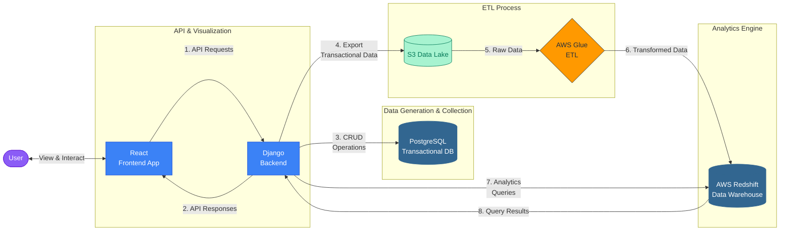

```mermaid
flowchart LR
    %% Data Flow Diagram
    
    %% Define the nodes
    User([User])
    ReactApp["React\nFrontend App"]
    Django["Django\nBackend"]
    TransDB[("PostgreSQL\nTransactional DB")]
    S3[(S3 Data Lake)]
    Glue{"AWS Glue\nETL"}
    Redshift[("AWS Redshift\nData Warehouse")]
    
    %% Define the data flow
    User <-->|"View & Interact"| ReactApp
    ReactApp -->|"1. API Requests"| Django
    Django -->|"2. API Responses"| ReactApp
    
    Django -->|"3. CRUD\nOperations"| TransDB
    
    Django -->|"4. Export\nTransactional Data"| S3
    
    S3 -->|"5. Raw Data"| Glue
    Glue -->|"6. Transformed Data"| Redshift
    
    Django -->|"7. Analytics\nQueries"| Redshift
    Redshift -->|"8. Query Results"| Django
    
    %% Add some explanatory text
    subgraph DataGeneration["Data Generation & Collection"]
        TransDB
    end
    
    subgraph ETLProcess["ETL Process"]
        S3
        Glue
    end
    
    subgraph AnalyticsEngine["Analytics Engine"]
        Redshift
    end
    
    subgraph APIAndVisualization["API & Visualization"]
        Django
        ReactApp
    end
    
    %% Styling
    classDef db fill:#326690,stroke:#326690,color:white
    classDef app fill:#3B82F6,stroke:#1D4ED8,color:white
    classDef storage fill:#A7F3D0,stroke:#047857,color:#047857
    classDef aws fill:#FF9900,stroke:#232F3E,color:#232F3E
    classDef user fill:#8B5CF6,stroke:#6D28D9,color:white
    
    class TransDB,Redshift db
    class Django,ReactApp app
    class S3 storage
    class Glue aws
    class User user
```