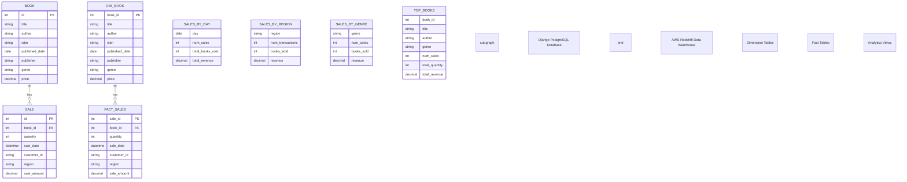

```mermaid
erDiagram
    %% Database Schema Diagram
    
    %% Transaction Database Schema
    BOOK {
        int id PK
        string title
        string author
        string isbn
        date published_date
        string publisher
        string genre
        decimal price
    }
    
    SALE {
        int id PK
        int book_id FK
        int quantity
        datetime sale_date
        string customer_id
        string region
        decimal sale_amount
    }
    
    %% Data Warehouse Schema
    DIM_BOOK {
        int book_id PK
        string title
        string author
        string isbn
        date published_date
        string publisher
        string genre
        decimal price
    }
    
    FACT_SALES {
        int sale_id PK
        int book_id FK
        int quantity
        datetime sale_date
        string customer_id
        string region
        decimal sale_amount
    }
    
    %% Analytics Views
    SALES_BY_DAY {
        date day
        int num_sales
        int total_books_sold
        decimal total_revenue
    }
    
    SALES_BY_REGION {
        string region
        int num_transactions
        int books_sold
        decimal revenue
    }
    
    SALES_BY_GENRE {
        string genre
        int num_sales
        int books_sold
        decimal revenue
    }
    
    TOP_BOOKS {
        int book_id
        string title
        string author
        string genre
        int num_sales
        int total_quantity
        decimal total_revenue
    }
    
    %% Relationships
    BOOK ||--o{ SALE : "has"
    DIM_BOOK ||--o{ FACT_SALES : "has"
    
    %% Group the tables
    subgraph TransactionalDB["Django PostgreSQL Database"]
        BOOK
        SALE
    end
    
    subgraph RedshiftWarehouse["AWS Redshift Data Warehouse"]
        subgraph DimensionTables["Dimension Tables"]
            DIM_BOOK
        end
        
        subgraph FactTables["Fact Tables"]
            FACT_SALES
        end
        
        subgraph AnalyticsViews["Analytics Views"]
            SALES_BY_DAY
            SALES_BY_REGION
            SALES_BY_GENRE
            TOP_BOOKS
        end
    end
```